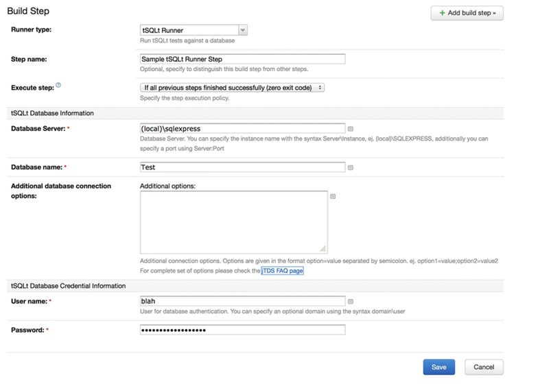

TeamCity runner for tSQLt
=====

[tSQLt](http://tsqlt.org) is a Unit Test Framework for TSQL (the SQL dialect in SQL Server). 

Most solutions to run tSQLt with TeamCity involves custom SQL and Powershell scripts and even RedGate has a tool for that (and a plugin for [TeamCity](http://www.jetbrains.com/teamcity/) as well). I needed something ever simpler, that can run tests already present in a database and report the results back. This is the result of that requirement.


Installation
---

* Get the zip file
* Stop your TeamCity server
* Place the zip file in the plugin directory of your TeamCity installation (check TeamCity documentation for details)
* Start your TeamCity server
* Configure and enjoy!


Configuration
---
An image says more than words:




Notes about configuration
---
* Windows SSO Authentication is supported only for Windows platforms, this is a limitation of the jTDS driver for Java.
* If you don't specify the port, default (1433) would be used.
* If using Windows Authentication instead of SQL Server Authentication you should specify the domain or machine name to log-in (using the notation domain\user).
* The runner doesn't prepare your database for testing, the recommended way is to have separate steps for creation/prepare the database before the tSQLt runner step and drop the database at the end. Believe me, you would thank me later for that advice.
* tSQLt is supported only in SQL Server 2005 and greater (You should check tSQLt documentation if you are using this plugin anyway).


Compiling the project
---
I updated the project to use the amazing  so it would be easy to build and do nice things (**yay!**). First, make sure of the following things:

* You have Java installed, JRE 6 is needed for TeamCity plugins (duh!) 
* You have a compatible JDK installed, TeamCity needs JDK 6
* You have a TeamCity installation in your machine (hey, after all, you are developing a TeamCity plugin)
* Hoorah! you are ready!

In the project directory you will find a file named ``gradle.properties``` just open it and place the directory where your TeamCity development packages are installed, usually is _the directory you installed TeamCity_/devPackages

No worries about dependencies, if everything is alright, Gradle will bootstrap and download all the dependencies from Maven (oh yes, you need an internet connection, of course!).

With Gradle you will have in the box a few commands to play with:

To run all the tests:
```
gradle test
```

To build the plugin (you will get the zip plugin file in the _distributions_ directory):
```
gradle assemblePlugin
```


What if I want to use IntelliJ?
---

Easy, just open IntelliJ, select "Import project" and point to the project directory, make sure you select "Gradle" in the model selection and voila! you have IntelliJ running!


What if I want to contribute
---
Hey, this is Github, the equivalent of Sparta in the coding world, just clone and send me a pull request, I am a nice person, I swear!
